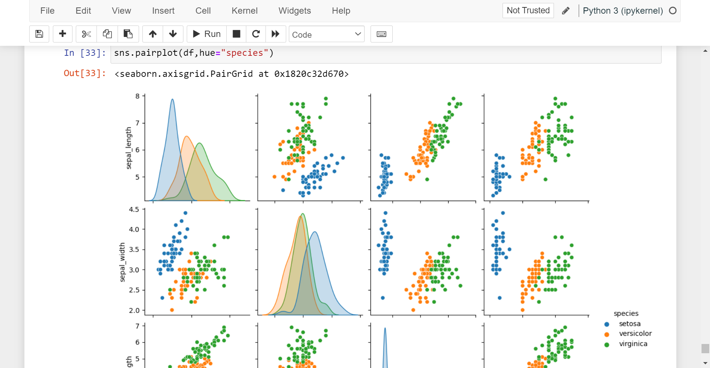
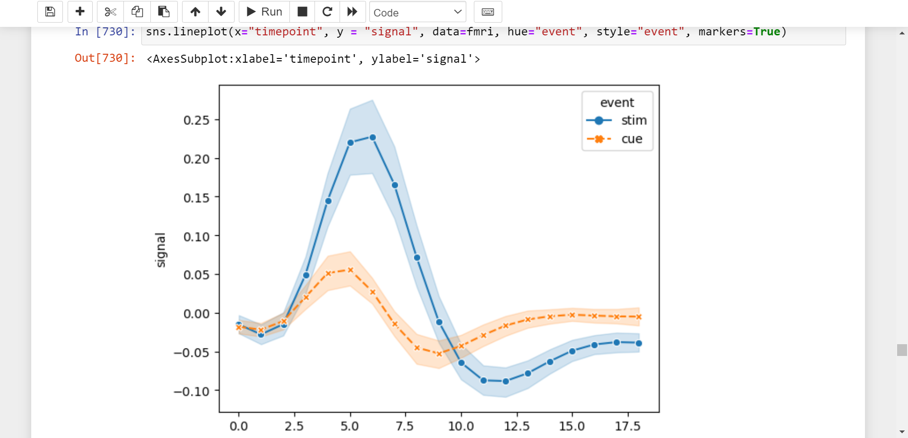
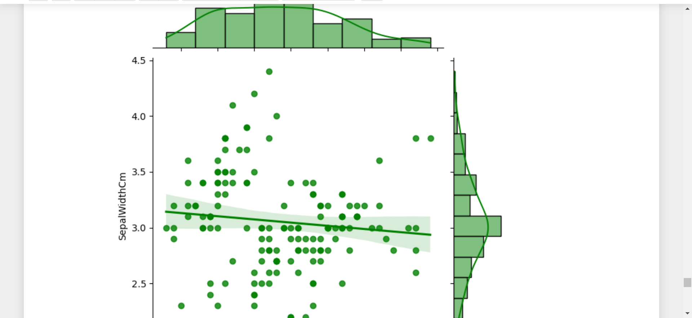

<!-- PROJECT -->
  <h3 align="center">
Welcome to Data Science Workspace
</h3>

  <p align="center">
  (Final Year Project, 2019-23 B.Tech GGITS, Jabalpur)
    <br />
    <a href="https://mudityadev.github.io"><strong>Muditya Raghav Portflio </strong></a>
  


<!-- TABLE OF CONTENTS -->
<details open="open">
  <summary>Table of Projects and Work</summary>
  <ol>
    <li><a href="#project-0">Overview - About The WorkSpace</a></li>
    <li><a href="#project-1">Python and it's Tools</a></li>
    <li><a href="#project-2">⚽ FIFA - Exploratory Data Analysis (EDA)</a></li>
    <li><a href="#project-3">🏏🪷 IPL - Exploratory Data Analysis (EDA)</a></li>
    <li><a href="#project-4"> 🦸 Marvel SuperHero - Exploratory Data Analysis</a></li>
   

    
   
  </ol>
</details>


<!-- ABOUT THE PROJECT -->
## Overview - About The Data Science Workspace


Data science is the study of data to extract meaningful insights for business. It is a multidisciplinary approach that combines principles and practices from the fields of mathematics, statistics, artificial intelligence, and computer engineering to analyze large amounts of data. <br>


<!-- project-1 -->
## Python and it's Tools 

* Data Structure - List, Dictionary, Sets
* Functions and Lambda
* OOPs Concept
* import libraries and 2D maxtrix operations

<!-- project-2 -->
## ⚽ FIFA - Exploratory Data Analysis (EDA)

* Import Dataset from kaggle
* extract data
* numpy, matplotlib, pandas and seaborn used


<!-- project-2 -->
## 🏏🪷 IPL - Exploratory Data Analysis (EDA)

* Import Dataset from kaggle
* extract data
* numpy, matplotlib, pandas and seaborn used


<!-- project-2 -->
## 🦸 Marvel SuperHero - Exploratory Data Analysis (EDA)

* Import Dataset from kaggle
* extract data
* numpy, matplotlib, pandas and seaborn used


<!-- ## How to Run

1. Windows 11 (64 bit ) or Ubuntu 20.04 or 18.04 (Environment)
2. Clone the Nexus-Project
```sh
   git clone https://github.com/mudityadev/Cloud-based-predictive-input-text-and-typing.git
   ```
2. Open Backend directory
 ```sh
   pip3 install -r requirements
   ```
3. Open Frontend directory
 ```sh
   npm install -g
   ```
4. Switch to backend directory
 ```sh
   python app.py
   ```
4. Open frontend directory
 ```sh
   npm start
   ```
5. Nexus Software Start... -->


<!-- Improvement -->
<!-- ## Possible Improvements -->

<!-- 1. Switch to mobile-based keyword
2. Integrate with UPI
3. 2-factor authenication of checkout
4. Ads using keyword
5. Nexus’s search techniques to analyze and categorize the most popular words and phrases, and could be a major advantage in Nexus’s future plans for getting the edge in search – more on that later.
 -->

<!-- CONTACT -->
## Contact

Muditya Raghav 
* [Muditya Raghav](https://mudityadev.github.io/mudityadev/)
* [Linkedin](https://www.linkedin.com/in/muditya/)
* [Twitter](https://twitter.com/mudityadev)
* [Gmail - rmuditya@gmail.com](rmuditya@gmail.com)
* [Gmail - mudityadev@gmail.com](mudityadev@gmail.com)
