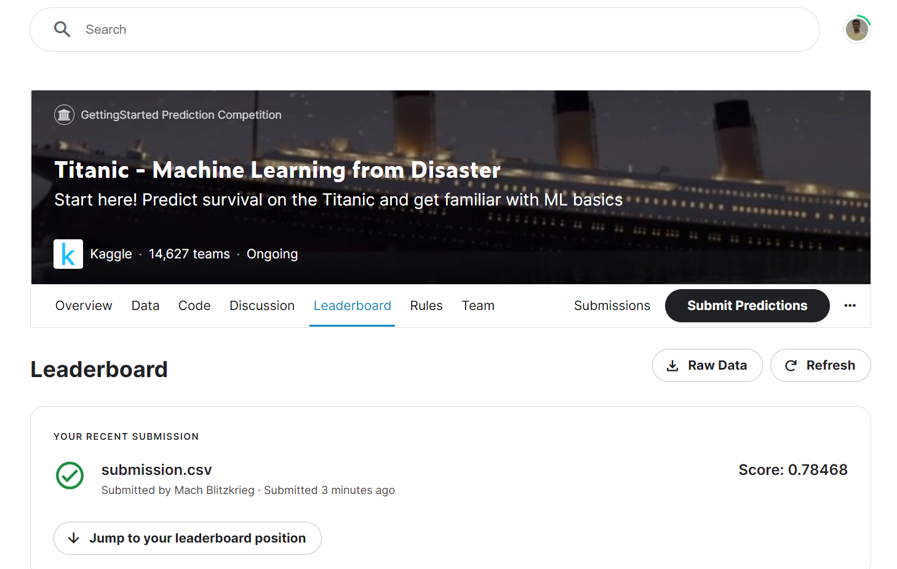
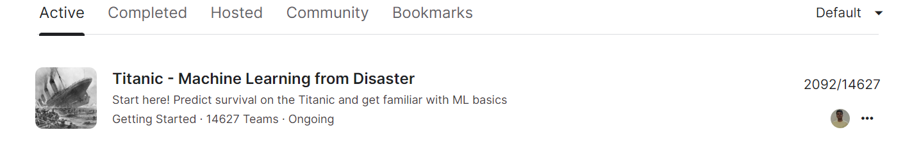

<!-- PROJECT -->
  <h3 align="center">
🚢🌊 Titanic - Machine Learning from Disaster (First Kaggle Project)
</h3>

  <p align="center">
  (First Kaggle Project, 2019-23 B.Tech GGITS, Jabalpur)
    <br />
    <a href="https://mudityadev.github.io"><strong>Muditya Raghav Portflio </strong></a>
  


<!-- TABLE OF CONTENTS -->
<details open="open">
  <summary>Table of Contents</summary>
  <ol>
    <li><a href="#Overview---About-The-Project">Overview - About The Project</a></li>
    <li><a href="#Tools-and-Technique">Tools and Libraries</a></li>
    <li><a href="#pipeline">Pipeline</a></li>
    <li>
      <a href="#How-to-Run">How to Run</a>
      <ul>
        <li><a href="#prerequisites">Environment Setup</a></li>
        <li><a href="#installation">Command on Terminal</a></li>
      </ul>
    </li>
    <li><a href="#More-Screenshots">Result</a></li>
    <li><a href="#Possible-Improvements">Possible Improvements and Future Work</a></li>
    <li><a href="#contact">Contact</a></li>
  </ol>
</details>


<!-- ABOUT THE PROJECT -->
### **Titanic** - Machine Learning from Disaster (Nov 2022)


<b>Objective</b> - use machine learning to create a model that predicts which passengers survived the Titanic shipwreck.

<b>Solution</b> - you to build a predictive model that answers the question: “what sorts of people were more likely to survive?” using passenger data (ie name, age, gender, socio-economic class, etc).. <br>


<!-- Tools -->
### Tools and Libraries
- Logistic Regression **(Result - 0.82)**
- K Nearest Neighbor **(Result - 0.81)**
- **(overfitted)** Support Vector Classifier **(Result - 0.833)**
- **(Best)** Soft Voting Classifier **(collective result of all model - 0.82)**

- Numpy **linear algebra**
- Pandas **(i/o csv)**
- Matplotlib **(Graph)**

### Pipeline
* Understanding the nature data .info() .describe()
  * datatype? numberical vs categorial? missing value? trends of data?
* Histogram and box-plots
* Value counts - bar-charts
* Focus on missing data - remove or improve
* Correlation b/w the metrix
* Brainstrome, interesting themes?
    * Weathy survived?
    * female > males
    * by location
    * young and wealthy?
    * anyone who knew swimming
    * fit person?
    * price or age scatterplot?
    
* Feature Engineering
* Preprocess data together or use a transformer?
    * use label for train and test
* Scaling
* Prediction/Tuning
* Submission


## How to Run

1. Windows 11 (64 bit ) or Ubuntu 20.04 or 18.04 (Environment)
2. Clone the Project
```sh
  > git clone 
   ```
2. Open command line in Titanic directory
 ```sh
  > jupyter notebook
   ```

<!-- Improvement -->
## Result
1. **Scoreboard**


<br />

<!-- Improvement -->
## Possible Improvements

1. Use different type algorithm like random forest..etc
2. Use of Deep Learning
3. Better Visualization using plots and charts
4. Tuning to model


<!-- CONTACT -->
## Contact
* [Muditya Raghav](https://mudityadev.github.io)
* [Linkedin](https://www.linkedin.com/in/muditya/) |  [Twitter](https://twitter.com/mudityadev)
* [mudityadev@gmail.com](mudityadev@gmail.com)
